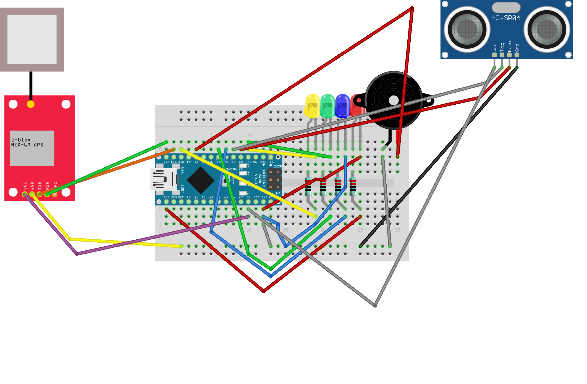

# Third Eye for the Blind

The Third Eye for the Blind is a gadget that helps visually impaired people know when something is in front of them. It uses an ultrasonic sensor to detect obstacles and then warns the person with sounds coming from a passive buzzer. This way, they have an extra "eye" to help them walk around safely. The device is wearable because it is attached to a glove. It also includes a GPS module, which logs the coordinates of where the person is. I have successfully learned how to code in the Arduino IDE, and I have successfully learned how to attach jumper wires and many other components to the breadboard. 


| Ria L | Edgemont Junior/Senior High School | Robotics | Incoming 8th Grader |

**Replace the BlueStamp logo below with an image of yourself and your completed project. Follow the guide [here](https://tomcam.github.io/least-github-pages/adding-images-github-pages-site.html) if you need help.**


  
# Final Milestone


<iframe width="560" height="315" src="https://www.youtube.com/embed/UGtpeNLKfsA?si=hkJR2alHgXosSFWz" title="YouTube video player" frameborder="0" allow="accelerometer; autoplay; clipboard-write; encrypted-media; gyroscope; picture-in-picture; web-share" referrerpolicy="strict-origin-when-cross-origin" allowfullscreen></iframe>

- Since my previous milestone, I have attached all the components to a glove, and I added a GPS module.
- My biggest challenge was learning how to code in the Arduino IDE and one of my biggest accomplishments was understanding the hardware aspect of my project and learning about where to put all the jumper wires and the LEDs.
- I learned a lot about ultrasonic sensors, GPS modules, and passive buzzers. I also learned how to wire my project by myself. Another thing I learned was learning how to problem solve by myself and not just relying on someone else. 
- In the future after everything I have learned I would like to work on more complicated projects and learn more about other devices such as Raspberry Pi.


# Second Milestone

**Don't forget to replace the text below with the embedding for your milestone video. Go to Youtube, click Share -> Embed, and copy and paste the code to replace what's below.**

<iframe width="560" height="315" src="https://www.youtube.com/embed/isymBIAF3qM?si=S9kcGJNzqX2WqV7-" title="YouTube video player" frameborder="0" allow="accelerometer; autoplay; clipboard-write; encrypted-media; gyroscope; picture-in-picture; web-share" referrerpolicy="strict-origin-when-cross-origin" allowfullscreen></iframe>

- I have added a passive buzzer that plays different tones based on how far the obstacle is from the ultrasonic sensor. This alerts the user if there is an object in front of them and tells them how far the object is from them. 
- I was surprised about how much code I had to write to do something simple like make the passive buzzer play notes. 
- One challenge that I faced was that my passive buzzer wasn't buzzing. I figured out that my passive buzzer was in the wrong pin on the breadboard. Another challenge was that my passive buzzer would start buzzing when my hand wasn't even in front of the ultrasonic sensor. This happened because I never said in my code for the passive buzzer to stop buzzing. Another challenge was that I ran out of ground pins because I had attached my LEDs and my ultrasonic sensor to them, so there wasn't a ground pin for the passive buzzer. I solved this by removing one wire that was connected to ground and replacing it with a wire that connects ground to the negative rail. This made it so the whole negative rail could serve as ground. This way I was able to connect my passive buzzer to ground. 
- I need to add a GPS tracker that can connect to my phone and put my project on a glove before my final milestone. 

# First Milestone


<iframe width="364" height="647" src="https://www.youtube.com/embed/mYxrYDSK_jU" title="Ria L. Milestone 1" frameborder="0" allow="accelerometer; autoplay; clipboard-write; encrypted-media; gyroscope; picture-in-picture; web-share" referrerpolicy="strict-origin-when-cross-origin" allowfullscreen></iframe>

For your first milestone, describe what your project is and how you plan to build it. You can include:
- The important components in my project are the ultrasonic sensor and the LEDs. 
- I have learned how to code in the Arduino IDE and upload code to the board. I have successfully made multiple LEDs light up using an ultrasonic sensor. When I faced problems such as an LED not lighting up or the code not working, I debugged them successfully.
- My breadboard is too big, so I want to use a smaller breadboard in the future so I can attach it to a glove. 
- I want to use a smaller breadboard to attach my project to a glove.

# Schematics 




# Base Project Code


```c++
#define TRIG_PIN   3 // The Arduino Nano pin connected to TRIG pin of ultrasonic sensor
#define ECHO_PIN   2 // The Arduino Nano pin connected to ECHO pin of ultrasonic sensor
int buzzerPin = 8;
int redpin = 13;
int bluepin = 4;
int greenpin = 5;
int yellowpin = 10;
float duration_us, distance_cm;

void setup() {
  // begin serial port
  Serial.begin (9600);
  // Configure the trigger pin to output mode
  pinMode(TRIG_PIN, OUTPUT);
  // Configure the echo pin to input mode
  
  pinMode(ECHO_PIN, INPUT);
  pinMode(buzzerPin, OUTPUT);
  tone(buzzerPin, 1000, 2000);
  pinMode(redpin, OUTPUT);
  pinMode(bluepin, OUTPUT);
  pinMode(greenpin, OUTPUT);
  pinMode(yellowpin, OUTPUT);
}

void loop() {
  // Produce a 10-microsecond pulse to the TRIG pin.
  digitalWrite(TRIG_PIN, HIGH);
  delayMicroseconds(10);
  digitalWrite(TRIG_PIN, LOW);

  // Measure the pulse duration from the ECHO pin
  duration_us = pulseIn(ECHO_PIN, HIGH);

  // calculate the distance
  distance_cm = 0.017 * duration_us;
  
  if (distance_cm<=10){
    tone(buzzerPin, 440); // A4
    digitalWrite(redpin,HIGH);
  
  } else if (distance_cm<20){
    tone(buzzerPin, 494); // B4
    digitalWrite(bluepin, HIGH);

  } else if (distance_cm<30){
    tone(buzzerPin, 523); // C4
    digitalWrite(greenpin, HIGH);
  } else if (distance_cm<40){
    tone(buzzerPin, 587); // D4
    digitalWrite(yellowpin,HIGH);
  } else {
    noTone(buzzerPin);
    digitalWrite(redpin, LOW);
    digitalWrite(bluepin, LOW);
    digitalWrite(greenpin, LOW);
    digitalWrite(yellowpin, LOW);
  }
delay(1000);
}

```
# GPS device Code


```c++

#include <TinyGPS++.h>
#include <SoftwareSerial.h>

static const int RXPin = 4, TXPin = 3;
static const uint32_t GPSBaud = 9600;

// The TinyGPS++ object
TinyGPSPlus gps;

// The serial connection to the GPS device
SoftwareSerial ss(RXPin, TXPin);

void setup(){
  Serial.begin(9600);
  ss.begin(GPSBaud);
}

void loop(){
  // This sketch displays information every time a new sentence is correctly encoded.
  while (ss.available() > 0){
    gps.encode(ss.read());
    if (gps.location.isUpdated()){
      // Latitude in degrees (double)
      Serial.print("Latitude= "); 
      Serial.print(gps.location.lat(), 6);      
      // Longitude in degrees (double)
      Serial.print(" Longitude= "); 
      Serial.println(gps.location.lng(), 6); 
       
      // Raw latitude in whole degrees
      Serial.print("Raw latitude = "); 
      Serial.print(gps.location.rawLat().negative ? "-" : "+");
      Serial.println(gps.location.rawLat().deg); 
      // ... and billionths (u16/u32)
      Serial.println(gps.location.rawLat().billionths);
      
      // Raw longitude in whole degrees
      Serial.print("Raw longitude = "); 
      Serial.print(gps.location.rawLng().negative ? "-" : "+");
      Serial.println(gps.location.rawLng().deg); 
      // ... and billionths (u16/u32)
      Serial.println(gps.location.rawLng().billionths);

      // Raw date in DDMMYY format (u32)
      Serial.print("Raw date DDMMYY = ");
      Serial.println(gps.date.value()); 

      // Year (2000+) (u16)
      Serial.print("Year = "); 
      Serial.println(gps.date.year()); 
      // Month (1-12) (u8)
      Serial.print("Month = "); 
      Serial.println(gps.date.month()); 
      // Day (1-31) (u8)
      Serial.print("Day = "); 
      Serial.println(gps.date.day()); 

      // Raw time in HHMMSSCC format (u32)
      Serial.print("Raw time in HHMMSSCC = "); 
      Serial.println(gps.time.value()); 

      // Hour (0-23) (u8)
      Serial.print("Hour = "); 
      Serial.println(gps.time.hour()); 
      // Minute (0-59) (u8)
      Serial.print("Minute = "); 
      Serial.println(gps.time.minute()); 
      // Second (0-59) (u8)
      Serial.print("Second = "); 
      Serial.println(gps.time.second()); 
      // 100ths of a second (0-99) (u8)
      Serial.print("Centisecond = "); 
      Serial.println(gps.time.centisecond()); 

      // Raw speed in 100ths of a knot (i32)
      Serial.print("Raw speed in 100ths/knot = ");
      Serial.println(gps.speed.value()); 
      // Speed in knots (double)
      Serial.print("Speed in knots/h = ");
      Serial.println(gps.speed.knots()); 
      // Speed in miles per hour (double)
      Serial.print("Speed in miles/h = ");
      Serial.println(gps.speed.mph()); 
      // Speed in meters per second (double)
      Serial.print("Speed in m/s = ");
      Serial.println(gps.speed.mps()); 
      // Speed in kilometers per hour (double)
      Serial.print("Speed in km/h = "); 
      Serial.println(gps.speed.kmph()); 

      // Raw course in 100ths of a degree (i32)
      Serial.print("Raw course in degrees = "); 
      Serial.println(gps.course.value()); 
      // Course in degrees (double)
      Serial.print("Course in degrees = "); 
      Serial.println(gps.course.deg()); 

      // Raw altitude in centimeters (i32)
      Serial.print("Raw altitude in centimeters = "); 
      Serial.println(gps.altitude.value()); 
      // Altitude in meters (double)
      Serial.print("Altitude in meters = "); 
      Serial.println(gps.altitude.meters()); 
      // Altitude in miles (double)
      Serial.print("Altitude in miles = "); 
      Serial.println(gps.altitude.miles()); 
      // Altitude in kilometers (double)
      Serial.print("Altitude in kilometers = "); 
      Serial.println(gps.altitude.kilometers()); 
      // Altitude in feet (double)
      Serial.print("Altitude in feet = "); 
      Serial.println(gps.altitude.feet()); 

      // Number of satellites in use (u32)
      Serial.print("Number os satellites in use = "); 
      Serial.println(gps.satellites.value()); 

      // Horizontal Dim. of Precision (100ths-i32)
      Serial.print("HDOP = "); 
      Serial.println(gps.hdop.value()); 
    }
  }
}

```


# Bill of Materials

| Elegoo Nano | Powers the whole entire project | $15.99 | <a href="https://www.amazon.com/ELEGOO-Pre-soldered-ATmega-Compatible-Arduino/dp/B0D5LYFRQP/ref=sr_1_3?crid=HIU6A6TMFOF5&dib=eyJ2IjoiMSJ9.4y3plYHd8ZWGHQBtCiNHBQPQKZM_SK97DtSvp6lOVnr61oORS_Gg40CqOLjAbVBvJHbdBc61VHTECXDVneg4Xy5Q8jk3dQ_TkmjkNAKiSPjrOHT9neQEpD8ZTChGnKW87P4kZQqfy_P_nq0W1QksjGP-h-WIuVHTnjP7huY6Kskw23oGbgcLTgiuSStLum6CjmZjDXux7OXJbV5yCMhiX_pTa4xHxS0E3fdq9K6UOlo.Z06NcDOY2XcloLdTp3ZAkbZSfMBlRIzLFvlUkJpXAOA&dib_tag=se&keywords=elegoo+nano&qid=1749224328&sprefix=elego+nano%2Caps%2C206&sr=8-3"> Link </a> |
| Electronics Kit | Contains all of the wires, LEDs, and the buzzer I used | $14 | <a href="https://www.amazon.com/Smraza-Electronics-Potentiometer-tie-Points-Breadboard/dp/B0B62RL725/ref=sxts_b2b_sx_reorder_acb_business?content-id=amzn1.sym.f63a3b0b-3a29-4a8e-8430-073528fe007f%3Aamzn1.sym.f63a3b0b-3a29-4a8e-8430-073528fe007f&crid=2IC3T44H3U3WG&cv_ct_cx=breadboard%2Bkit&dib=eyJ2IjoiMSJ9.TUd5tu2T8rmms7ZuJ0UzmbtpLL1zsu93bQM0PzwnP4E.sT0V0vL_QtbYv8ymVTCcRkhFNgBtRvRiT7G4FT1oGTE&dib_tag=se&keywords=breadboard%2Bkit&pd_rd_i=B0B62RL725&pd_rd_r=67e1f4ff-e3b9-44e4-b441-b4ae282f036b&pd_rd_w=UjFaP&pd_rd_wg=0xRoC&pf_rd_p=f63a3b0b-3a29-4a8e-8430-073528fe007f&pf_rd_r=BFGP77H27ZN31W4PZAW6&qid=1715911733&sbo=RZvfv%2F%2FHxDF%2BO5021pAnSA%3D%3D&sprefix=breadboard%2Bkit%2Caps%2C109&sr=1-2-9f062ed5-8905-4cb9-ad7c-6ce62808241a&th=1"> Link </a> |
| Ultrasonic Sensor | Detects the obstacle in front of the person | $9.99 | <a href="https://www.amazon.com/WWZMDiB-HC-SR04-Ultrasonic-Distance-Measuring/dp/B0CQCCGXCP/ref=sr_1_1_sspa?crid=3J2JR973WKPHO&dib=eyJ2IjoiMSJ9.E2SIkElJhtFWCJCHL5Q6Y73Ys_HCMPRVFCIrG_zKv4Og7BdZNtr69Mkju140lhlfzFGQuY542jpsp8FMrtV9d2hCBI7D8lYTH9bcgDXZhs4941uj-d1D69ZYdKmAI1Jig3VmYXOl3axVQ8Jq5L3nGRymNMtNbxkaFqGNyzkq4p37hhxU6jheuoaMo3Onz2FE9ILThkjUbdxRNW3rrZgZ7bYj9mf-yav85hBAmNduYyo.EneY3GmHDfDjDwhdUdDQ4Ktk6fECH62Adb42cEkehRc&dib_tag=se&keywords=ultrasonic%2Bsensor&qid=1715961326&sprefix=ultrasonic%2Bsensor%2Caps%2C72&sr=8-1-spons&sp_csd=d2lkZ2V0TmFtZT1zcF9hdGY&th=1"> Link </a> |

| Velcro | Attached all the components of the project to a glove | $7.98 | <a href="https://www.amazon.com/VELCRO-Brand-ONE-WRAP-Double-Sided-Multi-Purpose/dp/B000078CUB/ref=sr_1_21?crid=G8FXTWN2M9TA&keywords=velcro+brand+tape&qid=1685477947&sprefix=velcro+brand+tap%2Caps%2C161&sr=8-21"> Link </a> |

| USB power bank & cable | The power bank was connected to the Elegoo Nano to power it | $16.19 | <a href="https://www.amazon.com/SIXTHGU-Portable-Charger-Charging-Flashlight/dp/B0C7PHKKNK/ref=sr_1_2_sspa?crid=2ZZM4AAZMMWHQ&dib=eyJ2IjoiMSJ9.W2Zx5_I3mKOn6UpwAzOw6PD0PNh1iaMRBiedequdv9weeWL0HPyPcxJBR9h6-LiFW-sHKnHSApN0sUxx0Q9xIRs80R57IlvvCsmEzXcktogo-4nP-NxrEZOy5dJTcXY8N-PBwfGt4fl_9LP8npenzDUV9TPA8KN6DMu175g6JegC_gZhAJrbqX94EfpQhLwP9vIJH45w2N-AFrfZZOy9jqk55gzVyk4Qst8uZvqn768.KBrc5_SqZ4e8zCpoFc-1C7rk02t3o2ykgDPB65W5JJU&dib_tag=se&keywords=always%2Bon%2Bpower%2Bbank&qid=1715957917&sprefix=always%2Bon%2Bpower%2Bbank%2Caps%2C107&sr=8-2-spons&sp_csd=d2lkZ2V0TmFtZT1zcF9hdGY&th=1"> Link </a> |

| Glove | Was used to hold all of the components like the breadboard | $11.99 | <a href= "https://www.amazon.com/EvridWear-Light-duty-Outdoor-Painting-Gardening/dp/B092XXCTS5/ref=sr_1_2_sspa?crid=1TAIDHM4WSXL9&dib=eyJ2IjoiMSJ9.QPaR39SUUtekvWq8pwP4kc2Vebay3OXZjkeRbM8Rb4YF3QD61hmTpkii6l-nVKriUzfaYp2iKtddVlizCklRPDs9-m4F18EhD8fSVRSps56-Zhlmg1h7IpcXBHAwEzT4g848CzYl26AW604BLybIaL2kfa8rAPvK5XZoje-xKLtOSMJvaZM3j_ExNzDZKr29XKRe1k8wAVMRlAXlM5QTLZhYjy-ILloyJLjHWEeTgAY5pnSjpDYA6P68ejtJzE6nXtWs_P2PQz-E51kxwSBo7a2zhUEUoGXIGIgBQDLrivw.WKPlyk-oAwW9jgmY49SKUqvJM7jAqrvz7FzuODkQMEw&dib_tag=se&keywords=knitted%2Bwork%2Bglove&qid=1754752774&sprefix=knitted%2Bwork%2Bglove%2Caps%2C81&sr=8-2-spons&sp_csd=d2lkZ2V0TmFtZT1zcF9hdGY&th=1&psc=1"> Link </a> |

| Small Breadboards | Base of the circuit | $6.59 | <a href= "https://www.amazon.com/dp/B082VYXDF1?psc=1&smid=AX8SR0V05IQ2E&ref_=chk_typ_imgToDp"> Link </a> |

| GPS Module Neo 6M	 | Able to detect where the device is and sends the information to the computer | $9.99 | <a href= "https://www.amazon.com/YELUFT-GY-NEO6MV2-Control-Support-Raspberry/dp/B0F2DKWJ4J/ref=sr_1_1_sspa?crid=YIJN3XOV6SIE&dib=eyJ2IjoiMSJ9.Sfj41FocQDHbn31Bq4ZsLFam_mb1JZdLv6uClKiVsxdAfm_IQRs27TNnHQSCoW_wxffi_NMqYrqV_Qy-NqmfkeauXNHFT2NaY1Rc1dMG8TSZU44uKFiK5cTBZRvhxZA235xN2X7WN6bDibB8O9yIOPFGozO5jIFPInZ6cIeya2HtLJs5USvi5oQZxRqu1vbDg9z_lZ7hM_sQDMC3RBaLAnTjPcx2o_MLY_G5KDL4ZPo.q9jueaLO4CDwWURbNXZPYQ9B42FH7HjSzCnN4a_gNtA&dib_tag=se&keywords=gps%2Bmodule%2Bneo%2B6m&qid=1754942626&sprefix=gps%2Bmodule%2Bneo%2B%2Caps%2C102&sr=8-1-spons&sp_csd=d2lkZ2V0TmFtZT1zcF9hdGY&th=1"> Link </a> |

# Other Resources/Examples
One of the best parts about Github is that you can view how other people set up their own work. Here are some past BSE portfolios that are awesome examples. You can view how they set up their portfolio, and you can view their index.md files to understand how they implemented different portfolio components.
- [Example 1](https://trashytuber.github.io/YimingJiaBlueStamp/)
- [Example 2](https://sviatil0.github.io/Sviatoslav_BSE/)
- [Example 3](https://arneshkumar.github.io/arneshbluestamp/)

To watch the BSE tutorial on how to create a portfolio, click here.
